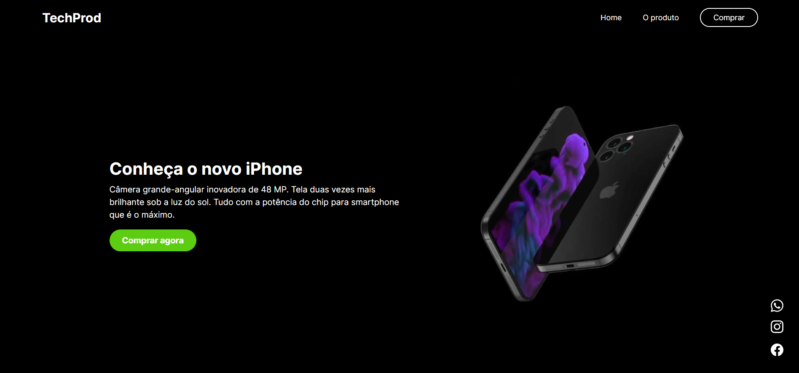
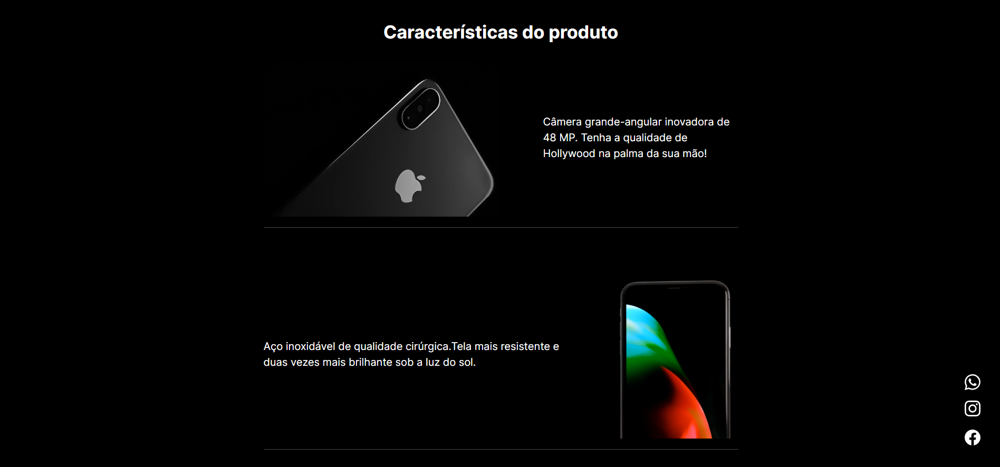
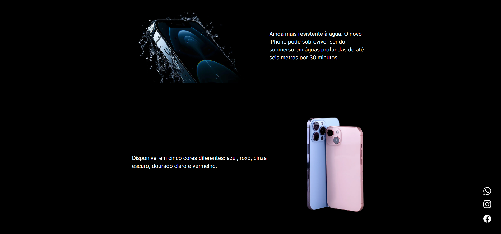
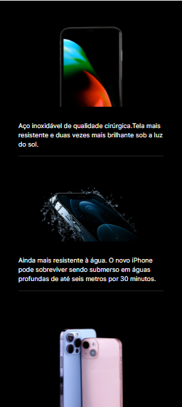
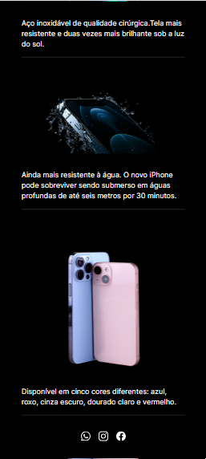

<h1 align="center">Landing Page - iPhone</h1>

## ℹ️About
This is a Next.js project that simulates a landing page to promote the new iPhone.

## 💻Technologies:
* Next.js
* Typescript
* HTML5
* SCSS

## 🌐Deploy

## 📷Images

## 🛰Running the project
<pre>
  <code>git clone https://github.com/francinehahn/landing-page-iphone.git</code>
</pre>

<pre>
  <code>cd landing-page-iphone</code>
</pre>

<pre>
  <code>npm install</code>
</pre>

<pre>
  <code>npm run dev</code>
</pre>
